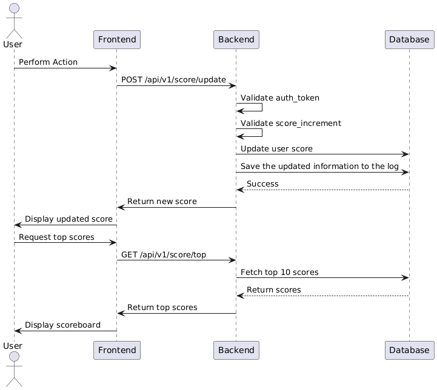

# Use Cases

## 1. **Updates Score**
**Precondition:** User must be authenticated and authorized. \
**Postcondition:** Score board will be updated.

**Main Flow:**
1. User performs an action that triggers a score update.
2. The frontend sends a `POST` request to `/api/v1/score/update`.
3. Backend validates the request and updates the score.
4. The new score is stored, logged, and returned to the frontend.
5. The updated score is reflected in the live scoreboard.

**Alternative Flow:**
- If the authentication token is invalid, return an error.
- If the score increment is outside the allowed range, reject the request.

**Non Functional Requirement:**
- Only users in the system who have completed the required actions to increase their points can have their points increased.
- Rate-limit requests to prevent spam or abuse.


## 2. **Get Top 10 User's Scores**
**Precondition:** Scores are stored in the database.

**Main Flow:**
1. The frontend sends a `GET` request to `/api/v1/score/top`.
2. Backend retrieves the top 10 user's scores.
3. The data is sent to the frontend for display.

**Alternative Flow:**
- If the database is overloaded, serve cached data.

**Non Functional Requirement:**
- Live update of top 10 user's scores


# Sequence Diagram describe workflow:


# Add additional comment:

1. **Clarify the Scoreboard Update Mechanism**  
- Specify how the scoreboard will be updated in real-time: using WebSockets, Server-Sent Events (SSE), or polling?  

2. **Error Handling and Data Consistency**  
- If a score update request fails (e.g., due to network issues or server errors), how should the system handle it?

3. **Performance Considerations** 
- How many users does the system have approximately? 
- When is the peak usage time? 
- When is the lowest usage time?


# Specification will be given to a backend engineering team:
#### **1. API for Updating Scores**  
- **Endpoint:** `POST /api/v1/score/update`  
- **Request Body:**  
  ```json
  {
    "userId": "123",
    "score": 10
  }
  ```  
- **Response:**  
  ```json
  {
    "status": "success",
    "new_score": "integer"
  }
  ```  
- **Authentication:** Use JWT tokens to verify the user's identity.  
- **Rate Limiting:** Limit the number of score updates per minute to prevent abuse (The limit number depends on the user's action to increase their score).  

#### **2. API for Get Top 10 User's Scores**  
- **Endpoint:** `GET /api/v1/score/top`  
- **Response:**  
  ```json
  {
    "scores": [
      {"user_id": "string", "score": "integer"},
      {"user_id": "string", "score": "integer"},
      ...
    ]
  }
  ```  
- **Security Considerations:**
    - Ensure no personally identifiable information (PII) is leaked.
    - Implement caching to reduce database load.
 

#### **2. Real-Time Scoreboard Updates**  
- Use **WebSockets** to push updates to clients immediately.  
- Alternative: Implement **polling** with an interval of a few seconds (less efficient).  

#### **3. Security & Anti-Cheating Measures**  
- Validate API requests with authentication tokens.  
- Ensure the score increase is triggered by a valid action, preventing direct API manipulation.  
- Log all score update requests for fraud detection and auditing.  

#### **4. Performance Optimization**  
- Use **Redis cache** to store and serve the top 10 scores, reducing database queries.  
 
